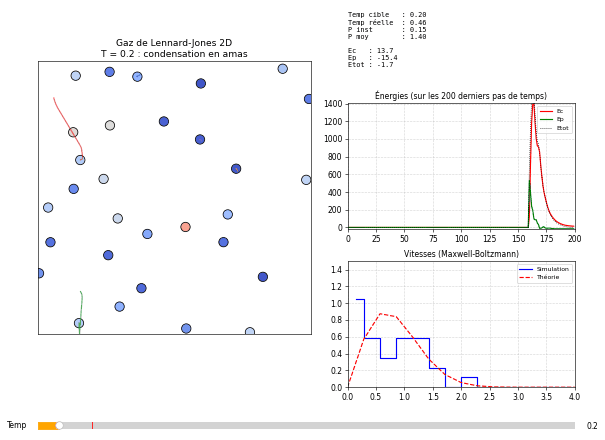

# Dynamique moléculaire : gaz de Lennard-Jones en 2D

Simulation de **dynamique moléculaire** d'un gaz réel bidimensionnel : on intègre les équations de Newton de $N$ particules en interaction, puis on en déduit les grandeurs thermodynamiques (température, pression, énergies) et l'état de la matière. Une interface interactive permet de changer la température en direct avec un curseur.



*Scénario de l'animation (environ 6 000 pas de temps) : à T = 0,2, les particules s'agrègent en un amas compact ; à T = 0,5, l'amas fond et s'évapore en partie ; à T = 5, le gaz remplit toute la boîte ; de retour à T = 0,2, il se recondense. À droite : énergies au cours du temps et distribution des vitesses comparée à la loi de Maxwell-Boltzmann. En bas : le curseur de température.*

> **En bref**
> - 30 particules interagissant par le potentiel de Lennard-Jones, intégrées par l'algorithme de Verlet-vitesse.
> - Température contrôlée par un thermostat de Berendsen, pression calculée par le théorème du viriel.
> - Transition observée entre un amas condensé ($E_p \approx -68$, pression quasi nulle) et un gaz ($E_c \approx 150$, pression ≈ 2,1, supérieure à celle du gaz parfait).
> - Les vitesses suivent la distribution de Maxwell-Boltzmann 2D : le système est bien thermalisé.

## Sommaire

1. [Objectif](#1-objectif)
2. [Physique](#2-physique)
3. [Méthode numérique](#3-méthode-numérique)
4. [Implémentation](#4-implémentation)
5. [Résultats et analyse](#5-résultats-et-analyse)
6. [Limites et pistes](#6-limites-et-pistes)
7. [Lancer le code](#7-lancer-le-code)
8. [Références](#8-références)

---

## 1. Objectif

Simuler le comportement microscopique d'un gaz réel pour en déduire ses propriétés macroscopiques. Contrairement au gaz parfait, les particules interagissent : elles se repoussent à courte distance et s'attirent à plus longue distance. Toute la difficulté est de passer d'une description purement mécanique (équations de Newton) à des grandeurs thermodynamiques, en mettant en place des conditions aux limites, un intégrateur temporel et un thermostat.

## 2. Physique

### Le potentiel de Lennard-Jones

L'interaction entre deux particules neutres (atomes de gaz rare, par exemple) séparées d'une distance $r$ est modélisée par :

$$V(r) = 4\varepsilon\left[\left(\frac{\sigma}{r}\right)^{12} - \left(\frac{\sigma}{r}\right)^{6}\right]$$

- le terme en $r^{-12}$ décrit la **répulsion** à très courte portée (recouvrement des nuages électroniques, principe de Pauli) ;
- le terme en $r^{-6}$ décrit l'**attraction** de Van der Waals ;
- $\sigma$ est la distance où le potentiel s'annule (diamètre effectif) ;
- le minimum vaut $-\varepsilon$ et se trouve en $r_{min} = 2^{1/6}\sigma \approx 1{,}12\thinspace\sigma$.

La force exercée par $j$ sur $i$ dérive du potentiel, $\vec F_{ij} = -\nabla_i V(r_{ij})$ :

$$\vec F_{ij} = \frac{24\thinspace\varepsilon}{r_{ij}^2}\left[2\left(\frac{\sigma}{r_{ij}}\right)^{12} - \left(\frac{\sigma}{r_{ij}}\right)^{6}\right]\vec r_{ij}, \qquad \vec r_{ij} = \vec r_i - \vec r_j$$

### Unités réduites

On pose $m = k_B = \varepsilon = \sigma = 1$ : toutes les grandeurs s'expriment en unités de Lennard-Jones. Pour l'argon, $\varepsilon/k_B \approx 120$ K et $\sigma \approx 3{,}4$ Å : une température réduite $T = 1$ correspond à environ 120 K.

### Température

Par le théorème d'équipartition, chaque degré de liberté porte en moyenne $\frac{1}{2}k_B T$. En 2D, chaque particule en a deux, d'où :

$$E_c = \sum_i \frac{1}{2} m v_i^2 = N k_B T \quad \Longrightarrow \quad T = \frac{E_c}{N} \ \text{(unités réduites)}$$

### Pression et théorème du viriel

La pression d'un gaz réel contient deux contributions : l'agitation thermique (comme pour le gaz parfait) et les forces entre particules. En 2D, avec $A$ l'aire de la boîte :

$$P = \frac{1}{A}\left(E_c + \frac{1}{2}\sum_{i \lt j} \vec r_{ij}\cdot\vec F_{ij}\right)$$

Le premier terme redonne la loi du gaz parfait, $P A = N k_B T$. Le second, le **viriel**, est positif quand la répulsion domine (collisions) et négatif quand l'attraction domine.

### Distribution de Maxwell-Boltzmann

À l'équilibre, la norme des vitesses suit en 2D la loi :

$$f(v) = \frac{v}{k_B T}\thinspace\exp\left(-\frac{v^2}{2k_B T}\right)$$

Vérifier que l'histogramme des vitesses simulées suit cette loi est un test direct de **thermalisation**.

### Ensembles statistiques

Un système isolé régi par les seules équations de Newton conserve son énergie (ensemble microcanonique NVE). Couplé à un thermostat, il échange de l'énergie avec un bain fictif pour maintenir sa température (ensemble canonique NVT).

## 3. Méthode numérique

### Intégrateur de Verlet-vitesse

À chaque pas de temps $\Delta t$ :

$$\vec v\left(t + \tfrac{\Delta t}{2}\right) = \vec v(t) + \tfrac{1}{2}\vec a(t)\thinspace\Delta t$$

$$\vec r(t + \Delta t) = \vec r(t) + \vec v\left(t + \tfrac{\Delta t}{2}\right)\Delta t$$

$$\text{calcul des forces} \ \rightarrow\ \vec a(t + \Delta t)$$

$$\vec v(t + \Delta t) = \vec v\left(t + \tfrac{\Delta t}{2}\right) + \tfrac{1}{2}\vec a(t + \Delta t)\thinspace\Delta t$$

Ce schéma est d'ordre 2, réversible en temps et **symplectique** : il conserve très bien l'énergie sur de longues durées, contrairement à un schéma d'Euler. C'est l'intégrateur standard de la dynamique moléculaire.

### Calcul des forces

On parcourt toutes les paires $(i, j)$ avec $i < j$ : 435 paires pour 30 particules. Grâce au principe d'action-réaction ($\vec F_{ji} = -\vec F_{ij}$), chaque paire n'est calculée qu'une fois. Pour éviter les puissances coûteuses, on part de $(\sigma/r)^2$, puis on en déduit $(\sigma/r)^6$ et $(\sigma/r)^{12}$ par multiplications.

### Murs réfléchissants

Une particule qui sort de la boîte est replacée par symétrie à l'intérieur, et la composante de sa vitesse perpendiculaire au mur est inversée (choc élastique).

### Thermostat de Berendsen

À chaque pas, toutes les vitesses sont multipliées par :

$$\lambda = 1 + 0{,}1\left(\sqrt{T_{cible}/T} - 1\right)$$

Le facteur 0,1 amortit la correction pour ne pas brusquer le système. Au premier ordre, c'est le thermostat de Berendsen $\lambda = \sqrt{1 + \frac{\Delta t}{\tau}\left(\frac{T_{cible}}{T} - 1\right)}$ avec un temps de relaxation $\tau = 10\thinspace\Delta t$.

### Sécurité au démarrage

Les positions initiales sont tirées au hasard : certaines particules apparaissent presque superposées, et la répulsion en $r^{-12}$ devient gigantesque. Pour éviter l'explosion numérique, la distance utilisée dans le calcul des forces est plafonnée à $r = 0{,}8\thinspace\sigma$. On observe malgré tout un pic d'énergie sur les tout premiers pas, que le thermostat résorbe rapidement. Une fois le système thermalisé, ce plafond n'intervient plus : même à $T = 5$, aucune paire ne s'approche à moins de $0{,}8\thinspace\sigma$ (distance minimale observée : $0{,}83\thinspace\sigma$).

## 4. Implémentation

### Structure

1. **Initialisation** : positions uniformes dans la boîte, vitesses gaussiennes de variance $T$ (graine aléatoire fixe pour la reproductibilité), historiques des énergies et de la pression.
2. **Moteur physique** (`update`) : Verlet-vitesse partie 1, murs, forces et viriel, Verlet-vitesse partie 2, grandeurs thermodynamiques, thermostat.
3. **Tableau de bord Matplotlib**, découpé avec `GridSpec` :

| Zone | Contenu |
|---|---|
| gauche | les particules, colorées selon la norme de leur vitesse, et la trajectoire de 5 d'entre elles |
| haut droite | température cible et réelle, pression instantanée et moyenne, énergies |
| milieu droite | $E_c$, $E_p$ et $E_{tot}$ sur les 200 derniers pas |
| bas droite | histogramme des vitesses et loi de Maxwell-Boltzmann à la température mesurée |
| bas | curseur de température cible (0 à 5) |

### Paramètres

| Paramètre | Valeur | Rôle |
|---|---|---|
| `N` | 30 | nombre de particules |
| `boxsize` | 10 | côté de la boîte, soit une aire $A = 100$ |
| `dt` | 0,01 | pas de temps |
| `epsilon`, `sigma` | 1, 1 | paramètres de Lennard-Jones |
| `temp_ini` | 0,5 | température cible de départ |

### GIF de démonstration

L'option `--sauver` joue un scénario sans souris, en déplaçant le curseur de température par programme :

| Étape | Température cible | Durée | Une image tous les |
|---|---|---|---|
| Condensation | 0,2 | 2 000 pas | 20 pas |
| Fusion et évaporation partielle | 0,5 | 1 500 pas | 20 pas |
| Gaz | 5 | 600 pas | 4 pas |
| Recondensation | 0,2 | 2 000 pas | 20 pas |

Les phases lentes (condensation) sont accélérées, la phase gazeuse est montrée presque en temps réel pour que les trajectoires restent lisibles.

## 5. Résultats et analyse

| | $T = 0{,}2$ | $T = 5$ |
|---|---|---|
| Énergie cinétique $E_c$ | ≈ 6 | ≈ 150 |
| Énergie potentielle $E_p$ | ≈ −68 | fluctue autour de −10 |
| Énergie totale | ≈ −62, fortement négative | ≈ +140 |
| Pression moyenne | ≈ 0 | ≈ 2,1 |
| Pression du gaz parfait $N k_B T / A$ | 0,06 | 1,5 |
| État | amas condensé | gaz remplissant la boîte |

### Changement d'état

À **basse température**, l'énergie cinétique ne suffit pas à vaincre l'attraction : les particules s'agrègent en un amas compact et oscillent autour de positions d'équilibre. C'est un état condensé (solide ou liquide dense). Les particules s'y arrangent de façon compacte, proche du réseau triangulaire, l'empilement le plus dense en 2D.

À **température intermédiaire** ($T = 0{,}5$), l'amas perd son arrangement ordonné : les particules y bougent davantage, certaines s'en détachent et partent en vol libre. L'énergie potentielle remonte d'environ −67 à environ −40 : une partie des liaisons est rompue. On est proche de la zone où liquide et gaz coexistent.

À **haute température**, l'agitation thermique l'emporte : les particules occupent tout l'espace, avec de longs vols libres interrompus par des collisions.

**Retour au froid.** En redescendant à $T = 0{,}2$, le gaz se recondense en un nouvel amas, de forme différente du premier : le changement d'état est réversible, mais la configuration exacte dépend de l'histoire des collisions.

### Bilan des énergies

- À $T = 0{,}2$, l'énergie potentielle domine largement. On peut la vérifier à la main : chaque liaison entre voisines proches vaut environ $-\varepsilon$, et dans un réseau triangulaire chaque particule a 6 voisines, soit 3 liaisons par particule. Un amas de 30 particules, dont beaucoup sont en bordure, en compte moins : la simulation trouve 67 paires de voisines proches, d'où $E_p \approx -67\thinspace\varepsilon$, en accord avec l'énergie mesurée.
- À $T = 5$, l'énergie cinétique domine. L'énergie potentielle fluctue autour de valeurs faibles, avec des pics positifs lors des collisions violentes à très courte distance (terme répulsif en $r^{-12}$).
- Dans les deux régimes, l'énergie totale reste stable une fois l'équilibre atteint, ce qui valide l'intégrateur malgré l'action du thermostat.

### Pression et gaz réel

- À $T = 0{,}2$, la pression est quasi nulle : l'amas central ne touche pas les parois, et l'attraction compense la faible agitation thermique.
- À $T = 5$, la pression (≈ 2,1) dépasse d'environ 40 % celle du gaz parfait (1,5) : les collisions fréquentes rendent le viriel positif. C'est exactement l'écart au gaz parfait qu'un gaz réel doit présenter à haute température.

### Thermalisation

L'histogramme des vitesses suit la forme asymétrique de la loi de Maxwell-Boltzmann 2D : étroit à basse température (vitesse la plus probable $\sqrt{T} \approx 0{,}45$), étalé à haute température ($\sqrt{T} \approx 2{,}2$). L'aspect en escalier vient du faible nombre de particules ($N = 30$), pas d'un défaut de la simulation.

## 6. Limites et pistes

- **Coût en $O(N^2)$** : les forces sont calculées sur toutes les paires avec des boucles Python, ce qui convient à quelques dizaines de particules. Pour aller plus loin : vectorisation NumPy, rayon de coupure et listes de voisins (listes de Verlet), qui ramènent le coût à $O(N)$.
- **Murs durs** : les parois créent des effets de surface importants pour un si petit système. Des conditions aux limites périodiques (avec la convention de l'image minimale) simuleraient un morceau de gaz infini.
- **Plafond à $r = 0{,}8\thinspace\sigma$** : il ne sert qu'à absorber le choc du démarrage aléatoire. Une initialisation sur un réseau régulier le rendrait inutile.
- **Thermostat de Berendsen** : il contrôle bien la température moyenne mais ne produit pas exactement l'ensemble canonique. Les thermostats de Nosé-Hoover ou de Langevin le font.
- **Statistique** : avec 30 particules, les grandeurs fluctuent beaucoup. Plus de particules et des moyennes temporelles plus longues permettraient de tracer une équation d'état $P(T)$, voire un diagramme de phases.
- **Passage en 3D** : l'algorithme est identique, seules la dimension des tableaux et les formules d'équipartition et du viriel changent.

## 7. Lancer le code

```bash
pip install -r requirements.txt
python gaz_lennard_jones.py            # simulation interactive (curseur de température en bas)
python gaz_lennard_jones.py --sauver   # enregistre le GIF de démonstration dans figures/
```

## 8. Références

- L. Verlet, *Computer "experiments" on classical fluids. I. Thermodynamical properties of Lennard-Jones molecules*, Physical Review 159, 98 (1967).
- W. C. Swope, H. C. Andersen, P. H. Berens et K. R. Wilson, *A computer simulation method for the calculation of equilibrium constants for the formation of physical clusters of molecules*, Journal of Chemical Physics 76, 637 (1982).
- H. J. C. Berendsen et al., *Molecular dynamics with coupling to an external bath*, Journal of Chemical Physics 81, 3684 (1984).
- M. P. Allen et D. J. Tildesley, *Computer Simulation of Liquids*, Oxford University Press.
- D. Frenkel et B. Smit, *Understanding Molecular Simulation*, Academic Press.

---

Projet réalisé en binôme en M1 Physique à CY Cergy Paris Université (cours « Modélisation numérique / Computational physics », février 2026).
